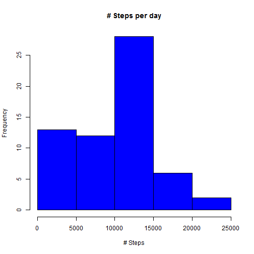
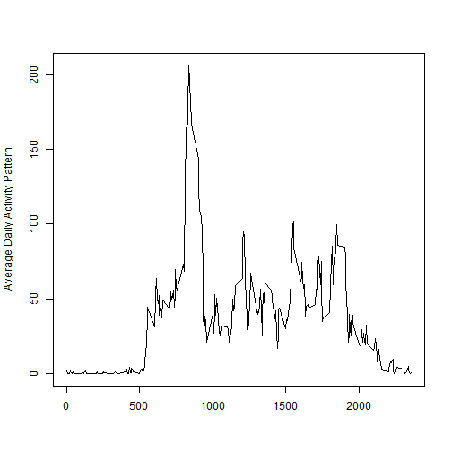
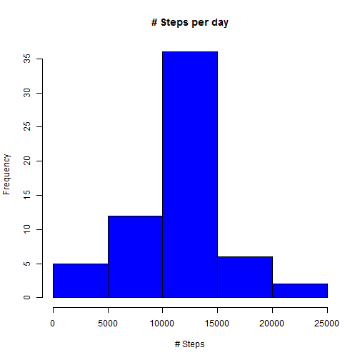
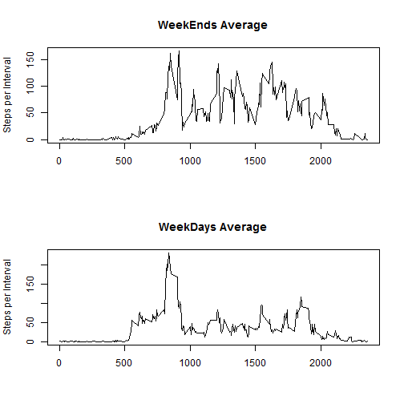

### This is the submission of the Assignment 1 for teh Coursera Course of Reproducible Research. Total of 4 questions are answered preceeded by importing the data.


## Pre - Processing

- First of all, as a pre-process, we'll download the file and extract the csv file and create the initail data frame .


```r
setInternet2(use = TRUE)
download.file("https://d396qusza40orc.cloudfront.net/repdata%2Fdata%2Factivity.zip", dest="dataset.zip", mode="wb") 
unzip("dataset.zip")
ip <- read.csv("activity.csv",stringsAsFactors=F)
```

- Next we'll pre-process the data for analysing the answers. 


- Below we are pre-processing to answer Question 1. The output dataset is q1prc which calculates total number of steps taken a day.


```r
q1prc <- aggregate(ip$steps, by=list(date=ip$date), FUN=sum,na.rm = TRUE)
head(q1prc)
```

```
##         date     x
## 1 2012-10-01     0
## 2 2012-10-02   126
## 3 2012-10-03 11352
## 4 2012-10-04 12116
## 5 2012-10-05 13294
## 6 2012-10-06 15420
```


- We'll now pre process data for Question 2. Output dataset is q2prc which takes average steps per interval across the dates.


```r
q2prc <- aggregate(ip$steps, by=list(interval=ip$interval), FUN=mean,na.rm = TRUE)
head(q2prc)
```

```
##   interval         x
## 1        0 1.7169811
## 2        5 0.3396226
## 3       10 0.1320755
## 4       15 0.1509434
## 5       20 0.0754717
## 6       25 2.0943396
```

- Pre-Process steps for Q3 and Q4 are done along with their respective sections.


## Question 1: What is mean total number of steps taken per day?


- Below data shows steps taken per day. All 61 day's data (unless fully filled with missing values) are shown.

```r
q1prc
```

```
##          date     x
## 1  2012-10-01     0
## 2  2012-10-02   126
## 3  2012-10-03 11352
## 4  2012-10-04 12116
## 5  2012-10-05 13294
## 6  2012-10-06 15420
## 7  2012-10-07 11015
## 8  2012-10-08     0
## 9  2012-10-09 12811
## 10 2012-10-10  9900
## 11 2012-10-11 10304
## 12 2012-10-12 17382
## 13 2012-10-13 12426
## 14 2012-10-14 15098
## 15 2012-10-15 10139
## 16 2012-10-16 15084
## 17 2012-10-17 13452
## 18 2012-10-18 10056
## 19 2012-10-19 11829
## 20 2012-10-20 10395
## 21 2012-10-21  8821
## 22 2012-10-22 13460
## 23 2012-10-23  8918
## 24 2012-10-24  8355
## 25 2012-10-25  2492
## 26 2012-10-26  6778
## 27 2012-10-27 10119
## 28 2012-10-28 11458
## 29 2012-10-29  5018
## 30 2012-10-30  9819
## 31 2012-10-31 15414
## 32 2012-11-01     0
## 33 2012-11-02 10600
## 34 2012-11-03 10571
## 35 2012-11-04     0
## 36 2012-11-05 10439
## 37 2012-11-06  8334
## 38 2012-11-07 12883
## 39 2012-11-08  3219
## 40 2012-11-09     0
## 41 2012-11-10     0
## 42 2012-11-11 12608
## 43 2012-11-12 10765
## 44 2012-11-13  7336
## 45 2012-11-14     0
## 46 2012-11-15    41
## 47 2012-11-16  5441
## 48 2012-11-17 14339
## 49 2012-11-18 15110
## 50 2012-11-19  8841
## 51 2012-11-20  4472
## 52 2012-11-21 12787
## 53 2012-11-22 20427
## 54 2012-11-23 21194
## 55 2012-11-24 14478
## 56 2012-11-25 11834
## 57 2012-11-26 11162
## 58 2012-11-27 13646
## 59 2012-11-28 10183
## 60 2012-11-29  7047
## 61 2012-11-30     0
```


- Here is a histogran for number of Steps taken per day. 

```r
hist(q1prc$x,col = 'blue',main = '# Steps per day', xlab = '# Steps')
```

 


- Below data provides the mean and median Number of steps taken per day. 

```r
mean(q1prc$x)
```

```
## [1] 9354.23
```

```r
median(q1prc$x)
```

```
## [1] 10395
```


## Question 2: What is the average daily activity pattern?


- To answer the question, we take the intervals and take the average step taken per day in this interval and plot it.

```r
plot(q2prc$interval, q2prc$x,type='n',main = "", xlab="", ylab="Average Daily Activity Pattern")
lines(q2prc$interval, q2prc$x,type='l')
```

 


- Finally we figure out the interval for which average steps taken per day is maximum. Also providing the maximum of Average number of steps with the interval said.

```r
q2prc[which(q2prc$x == max(q2prc$x)),]
```

```
##     interval        x
## 104      835 206.1698
```


## Question 3: Imputing missing values


- Following calculates number of missings in the dataset.

```r
length(which(is.na(ip$steps)))
```

```
## [1] 2304
```


- We take rounded off (to integer) average steps in an interval to fill up the NAs. q3final is the dataset equivalent to the original, with missing values imputed.


```r
q3proc <- merge(ip,q2prc,by = "interval")
q3proc <- q3proc[order(q3proc$date,q3proc$interval),]
q3proc$x <- as.integer(q3proc$x)
q3proc[which(is.na(q3proc$steps)),]$steps = q3proc[which(is.na(q3proc$steps)),]$x
q3final <- q3proc[,c("steps","date","interval")]
head(q3final)
```

```
##     steps       date interval
## 1       1 2012-10-01        0
## 63      0 2012-10-01        5
## 128     0 2012-10-01       10
## 205     0 2012-10-01       15
## 264     0 2012-10-01       20
## 327     2 2012-10-01       25
```


- Some Pre-Processing for finding new behavior after impuding the missing values.

```r
q3prc2 <- aggregate(q3final$steps, by=list(date=q3final$date), FUN=sum,na.rm = TRUE)
head(q3prc2)
```

```
##         date     x
## 1 2012-10-01 10641
## 2 2012-10-02   126
## 3 2012-10-03 11352
## 4 2012-10-04 12116
## 5 2012-10-05 13294
## 6 2012-10-06 15420
```


- Here is the Histogram at Question 1 created with missing values imputed, followed by new mean and medians.

```r
hist(q3prc2$x,col = 'blue',main = '# Steps per day', xlab = '# Steps')
```

 

```r
mean(q3prc2$x)
```

```
## [1] 10749.77
```

```r
median(q3prc2$x)
```

```
## [1] 10641
```


- Mean and median is changed by the below values.

```r
abs(mean(q3prc2$x) - mean(q1prc$x))
```

```
## [1] 1395.541
```

```r
abs(median(q3prc2$x) - median(q1prc$x))
```

```
## [1] 246
```


## Question 4: Are there differences in activity patterns between weekdays and weekends?


To answer this quetion we use the data after impuding missing values. 


- First of all, as pre processing, we separate Weekdays and Weekends as different daatasets and take their means separately.

```r
q4prc <- q3final
q4prc$day <- weekdays(as.POSIXct(q4prc$date))
q4prcwe <- q4prc[which(q4prc$day == "Sunday" | q4prc$day == "Saturday"),]
head(q4prcwe)
```

```
##     steps       date interval      day
## 26      0 2012-10-06        0 Saturday
## 96      0 2012-10-06        5 Saturday
## 150     0 2012-10-06       10 Saturday
## 231     0 2012-10-06       15 Saturday
## 272     0 2012-10-06       20 Saturday
## 343     0 2012-10-06       25 Saturday
```

```r
q4prcwd <- q4prc[which(!(q4prc$day == "Sunday" | q4prc$day == "Saturday")),]
head(q4prcwd)
```

```
##     steps       date interval    day
## 1       1 2012-10-01        0 Monday
## 63      0 2012-10-01        5 Monday
## 128     0 2012-10-01       10 Monday
## 205     0 2012-10-01       15 Monday
## 264     0 2012-10-01       20 Monday
## 327     2 2012-10-01       25 Monday
```

```r
q4prcweag <- aggregate(q4prcwe$steps, by=list(interval=q4prcwe$interval), FUN=mean,na.rm = TRUE)
head(q4prcweag)
```

```
##   interval     x
## 1        0 0.125
## 2        5 0.000
## 3       10 0.000
## 4       15 0.000
## 5       20 0.000
## 6       25 3.500
```

```r
q4prcwdag <- aggregate(q4prcwd$steps, by=list(interval=q4prcwd$interval), FUN=mean,na.rm = TRUE)
head(q4prcwdag)
```

```
##   interval          x
## 1        0 2.15555556
## 2        5 0.40000000
## 3       10 0.15555556
## 4       15 0.17777778
## 5       20 0.08888889
## 6       25 1.57777778
```


- Now we plot the weekends average and weekdays average in 2 different plots.

```r
par(mfrow = c(2,1))
plot(q4prcweag$interval,q4prcweag$x,type='l',main = "WeekEnds Average", xlab="", ylab="Steps per Interval") 
plot(q4prcwdag$interval,q4prcwdag$x,type='l',main = "WeekDays Average", xlab="", ylab="Steps per Interval") 
```

 


- The differences are clerly visible. On weekdays max steps are taken during 8:25-8:30 Morning time, and the rest of the day has very low number of steps on average. whearas for Weekends, the number of steps look to ve distributed over a longer peiod.


## This is the End of this assignment.


#                           :)  Thanks! :)
